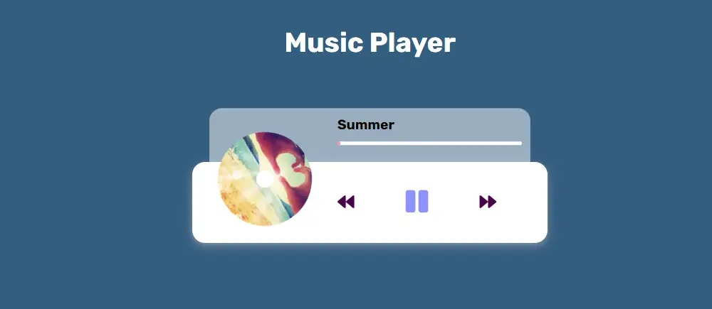

# 🎵 SwingBeats – Java Music Player System

SwingBeats is a full-featured desktop music player built with **Java Swing**, **MySQL**, and **JDBC**. It features secure authentication, user playlists, an admin control panel, and `.wav` music playback — all wrapped in a stylish dark-themed UI.



---

## 💡 Features

- 🔐 **User Authentication**  
  Secure Sign In / Sign Up using hashed passwords stored in MySQL.

- 🎧 **Music Playback**  
  Play `.wav` audio files directly through the Java application using `javax.sound.sampled`.

- ➕ **Playlist Management**  
  Add, remove, and manage personal playlists.

- 🔎 **Song Search & Sort**  
  Search songs by **title**, **artist**, or **genre** and sort the playlist as needed.

- 👑 **Admin Control Panel**  
  Admin users can manage all songs and registered users.

- 🎨 **Modern UI**  
  Custom-designed dark-themed interface built using Java Swing.


---

## 🧰 Tech Stack

| Technology      | Usage                     |
|----------------|---------------------------|
| Java (JDK 11+)  | Core application logic     |
| Java Swing      | Graphical User Interface   |
| MySQL           | Database system            |
| JDBC            | DB connectivity            |
| javax.sound     | WAV file playback          |
| MVC + DAO       | Code organization pattern  |

---

## 🗂️ Project Structure

```
SwingBeats/
├── src/
│   ├── dao/
│   ├── model/
│   ├── service/
│   ├── ui/
│   └── utils/
├── assets/
│   └── sample-music/
├── database/
│   └── schema.sql
├── images/
│   └── screenshots and icons
└── README.md
```

---

## 🛠️ Setup Instructions

### ✅ Prerequisites

- Java JDK 11 or later
- MySQL Server
- IDE like Eclipse or IntelliJ
- JDBC MySQL Connector (add to project build path)

### 📥 Installation Steps

1. **Clone the Repository**
   ```bash
   git clone https://github.com/RashmiMalar/MusicPlayer.git

   ```

2. **Import the Project into IDE**
   - Open Eclipse or IntelliJ
   - Import as a Java project
   - Add JDBC driver to classpath

3. **Set up the Database**
   - Create a new MySQL database:
     ```sql
     CREATE DATABASE swingbeats;
     ```
   - Run the `schema.sql` file from `/database/` to create tables.
   - Update DB credentials in the code (`DBConnection.java` or config file).

4. **Run the Application**
   - Start the MySQL server
   - Run the main class:
     ```java
     Main.java
     ```

---

## 🖼️ UI Snapshots

| Login Page                    | User Dashboard                   | Admin Dashboard                 |
|-------------------------------|----------------------------------|---------------------------------|
|     |      |       |

--- 

## 🔒 Security Notes

- Passwords are stored in hashed format (e.g., using SHA-256).
- User roles are validated for access control (Admin vs Normal User).

---

## 📌 Future Improvements

- Support for more file formats (MP3, AAC)
- Volume control and equalizer
- User profile customization
- Song recommendations

---

## 🤝 Contribution

Pull requests are welcome! For major changes, please open an issue first to discuss what you would like to change.

